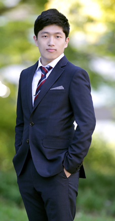

@snap[midpoint slide1]
<h1>Introduction</h1>
of 
@size[120%](Kim Hwigyeom)
  
2019.03.11
@snapend
---
@size[140%](@snap[east span-30]
)
@snapend

profile
================

* @color[orange](2012.03 ~ 2016.02) @size[80%](**Bachelor's course of @color[blue](Mechanical and Aerospace engineering)           in Seoul Nat'l Univ**)
  
* @color[orange](2016.03 ~ 2018.02) @size[80%](**master's course of @color[blue](Aerospace engineering)           in Seoul Nat'l Univ**)
  
* @color[orange](2018/08 ~    now) @size[80%](**master's course of information security          in KAIST (CryptoLab)**)

---

Self-diagonose
=================
* @color[orange](**Strength**) 
@size[80%](- Experience of system engineering - Different background with computer science )- @color[blue](**PASSION**) 
@size[80%](- Usable PL : C, C++, Arduino, MATLAB)  
* @color[orange](**Weakness**) 
@size[80%](- Do not have many experiences in web programming - Not good at  @color[blue](**PYTHON**))

---?image=MATLAB.PNG&position=bottom&size=40%

MATLAB experience
=================
* The most programmed language I used  
* From bachelor to master's degree, always used MATLAB  for research and data processing  
* Masters degree topic : GPS ionospheric error modelling

---?image=snuglite.png&position=right
Cubesat
==============
* 10cm by 10cm by 10cm micro satellite made for research & educational purpose  
* My former Lab made cubesat as a contest prize KARI made  
* Launched in Nov.2018, still on the sky  
* My role @color[blue](- Satellite orbit calculation - Ground station building)
